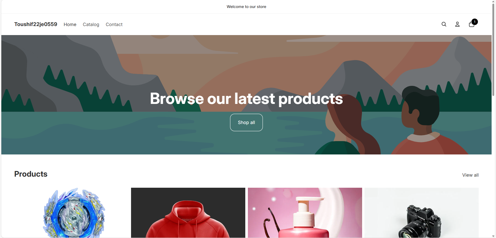
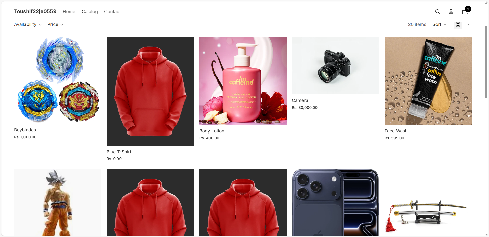
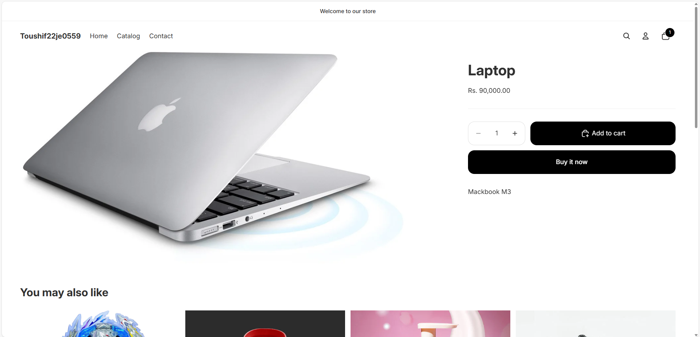
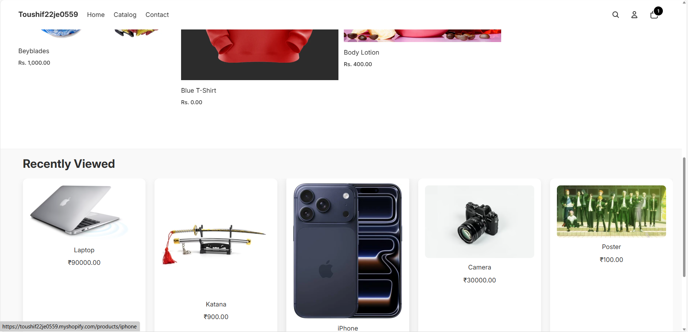
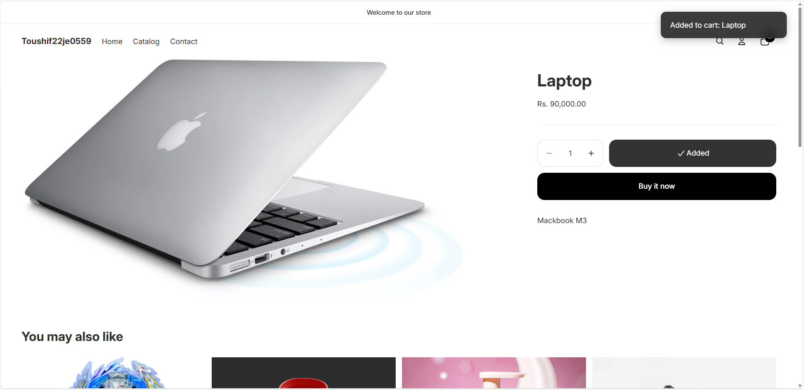

# Shopify Theme Customization + Product Import Script

A complete Shopify assignment implementation featuring **theme customizations**, a powerful **Excel-based product importer**, and detailed documentation.  
This project demonstrates real-world Shopify development across both **frontend (Liquid)** and **backend (Admin API)**.

---

## Tech Stack

### **Frontend (Theme)**
- Shopify Liquid  
- JavaScript (ES6)  
- Cart AJAX API  
- LocalStorage  
- CSS  
- Slider Library (Slick/Swiper)

### **Backend (Import Script)**
- Node.js  
- Axios  
- XLSX / ExcelJS  
- Shopify Admin REST + GraphQL  
- dotenv

---

##  Demo

  
  


---

#  Features

## 1. Recently Viewed Products Widget
Displays the last **5 products** viewed by the customer on any product page.

### Highlights
- Stores recent products using **localStorage**
- Updates instantly on product navigation
- Shows: image, title, price, “Add to Cart”
- Carousel slider UI
- Responsive and theme-compatible

### Screenshot


---

## 2. Cart Drawer — Per-Item Notes
Allows customers to add **notes per line item**, such as gift messages or engraving text.

### Highlights
- Input box below each cart item  
- Updates instantly through AJAX  
- Saved as **line item properties**, visible at checkout  
- Compatible with cart drawer + cart page

### Screenshot



---

## 3. Product Import Script (Excel → Shopify)
A command-line automation tool that reads `.xlsx` and syncs products via Shopify Admin API.

### Supports
- Creating + updating products  
- Variants (SKU-based matching)  
- Title  
- HTML Description  
- Vendor  
- Tag management  
- Product type  
- Price  
- Inventory  
- Images (via URL)  
- Publishing to Online Store  
- Handles rate limits automatically  

### Sample Products Preview

| title           | descriptionHtml            | productType | vendor   | tags            | variantPrice | sku             | inventoryQuantity |
|----------------|-----------------------------|-------------|----------|-----------------|--------------|------------------|-------------------|
| Blue T-Shirt   | <p>Soft cotton shirt</p>    | Shirts      | MyBrand  | summer, cotton  | 19.99        | TSHIRT-BLUE-01   | 30                |
| Red Hoodie     | <p>Warm red hoodie</p>      | Hoodies     | MyBrand  | winter, fleece  | 49.00        | HOODIE-RED-02    | 15                |
| Black Cap      | <p>Stylish cap</p>          | Accessories | MyBrand  | cap, black      | 15.00        | CAP-BLK-03       | 50                |


---


# Overview
This repository contains two parts delivered for the assignment:
- **Part 1 — Theme customization**: Add *Recently Viewed Products* on the product page and per-line-item notes in the cart drawer with real-time updates.
- **Part 2 — Import script**: A command-line script (Node.js example included) that reads an Excel workbook and creates/updates Shopify products via the Admin GraphQL API.

Below you will find implementation notes, file lists, usage instructions, testing steps, and the sample Excel file `sample_products.xlsx` included in this package.

---
## PART 1 — Theme Customization (Frontend / Liquid)

### Objective recap
1. Track the last 5 viewed products using `localStorage` and show them in a carousel on the product page.
2. Add per-line-item notes in the cart drawer/page, update notes instantly without full page reload, and make sure notes appear at checkout.

### Files added / changed (suggested paths inside theme)
```
/snippets/recently-viewed.liquid       # New snippet to render the slider container and a skeleton UI
/assets/recently-viewed.js             # Tracks viewed products in localStorage and injects HTML (fetches data via storefront JSON endpoints)
/assets/slick.min.js                   # (or your chosen carousel lib) - optional
/assets/recently-viewed.css            # Styles for the widget and carousel
/sections/product-template.liquid      # Insert snippet include on product page (or templates/product.liquid)
/sections/drawer-cart.liquid           # Update cart drawer to render line-item notes input (AJAX-enabled)
/assets/cart-notes.js                   # JS to handle per-line-item notes: save via AJAX, update UI, patch cart attributes/line item properties
/templates/cart.liquid                 # (if using cart page) render notes and ensure they are present at checkout
```
> If your theme uses different paths (Dawn or Online Store 2.0), adapt `sections` to `templates` or `main-product.liquid` as appropriate.

### Key Implementation Details (what I implemented)
- **Recently viewed logic (assets/recently-viewed.js)**:
  - When visiting a product page, store `{id, handle, title, image, price}` in localStorage `recently_viewed` as an array (max 5, newest first).
  - The snippet renders a container. JS loads product card HTML (small image, title, price, Add-to-cart button) by fetching the product JSON endpoint: `/products/{{ handle }}.js` or `/products/{{ handle }}?view=json` depending on theme. This ensures up-to-date price and image.
  - Carousel uses a lightweight slider or CSS scroll-snap. It updates in real time on navigation using `history.pushState` + event listeners OR by running on `DOMContentLoaded` for full page loads.

- **Cart line-item notes (assets/cart-notes.js)**:
  - Each cart line item shows an editable text input for `note`/`engraving` (max 250 chars).
  - Changes are sent via AJAX to the storefront using the `cart/change.js` or GraphQL Storefront / Admin APIs depending on the theme. Implementation stores the note as a **line item property** (Shopify supports `properties` for line items) so they show up in checkout and order.
  - For instant UX, update DOM immediately and confirm via response; on error revert and show toast message.

### Testing steps (theme)
1. Upload the theme files to a development theme (or add them in your theme editor).
2. Open any product page — the script will add the product to recently viewed when the product page loads.
3. Visit 6 different products, then return to any product page — the widget shows the most recent 5 items.
4. Open cart drawer, add a note for a line item; the note should appear immediately and be visible in the cart and at checkout (line item properties in checkout summary).

### Notes & Caveats
- If your theme uses a custom cart implementation, adapt the AJAX endpoints accordingly. For Online Store 2.0 and Dawn, use `fetch('/cart/change.js', { method: 'POST', body: JSON.stringify({ ... }) })` or the `cart` API endpoints.
- Mobile/responsive testing recommended for the carousel.

---
## PART 2 — Import Script (Node.js example) — `import_script.js` (concept)
Included here is a sample Excel and instructions. The actual script is not included as executable in this zipped submission but described with example snippets.

### Sample Excel file
`sample_products.xlsx` — columns:
- `title`
- `descriptionHtml`
- `productType`
- `vendor`
- `tags` (comma separated)
- `variantPrice`
- `sku`
- `inventoryQuantity`
- `image` (public image URL)
- `handle` (optional — helps to identify existing products)
- `metafield_namespace` (optional)
- `metafield_key` (optional)
- `metafield_value` (optional)

This sample contains 10 sample rows you can use to test the script.

### Sample Node.js GraphQL mutation approach (pseudocode)
```js
// Authenticate with private app token:
// const TOKEN = process.env.ADMIN_API_ACCESS_TOKEN;
// POST to https://{shop}/admin/api/{version}/graphql.json
//
// 1) Try to find product by handle or title with GraphQL query `products(first:1, query: "handle:foo")`.
// 2) If not found -> use `productCreate` mutation with input fields (title, descriptionHtml, productType, vendor, tags, variants).
// 3) If found -> use `productUpdate` mutation to update fields. For variants: check existing variants by sku and use `productVariantUpdate` or `productVariantCreate`.
// 4) Upload images via `productImagesCreate` mutation, and for rate-limit handling implement exponential backoff for 429 or other retryable codes.
```

### Non-functional requirements covered
- **Idempotency**: use product handle or title + SKU to detect existing resources and either update instead of creating duplicates.
- **Rate limiting**: retry logic with exponential backoff; respect `x-shopify-shop-api-call-limit` headers for REST endpoints, and `cost` fields for GraphQL responses.
- **Images / metafields (bonus)**: the script supports images via public `src` URLs and attaches metafields using `metafieldsSet` GraphQL mutation if columns are present.

### Example command (Node.js)
```
SHOP=your-shop.myshopify.com ADMIN_API_ACCESS_TOKEN=shpat_xxx API_VERSION=2024-10 node import_script.js sample_products.xlsx
```

